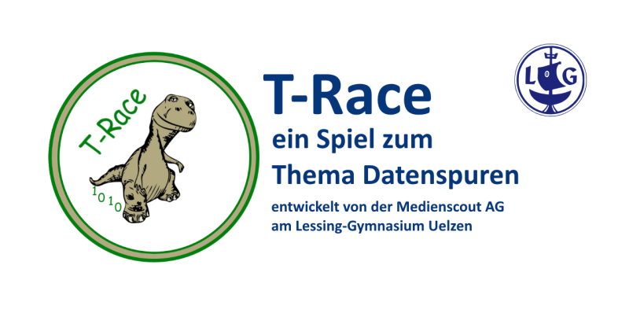
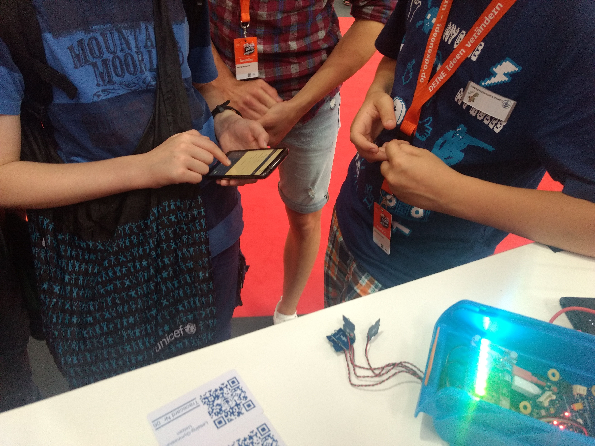
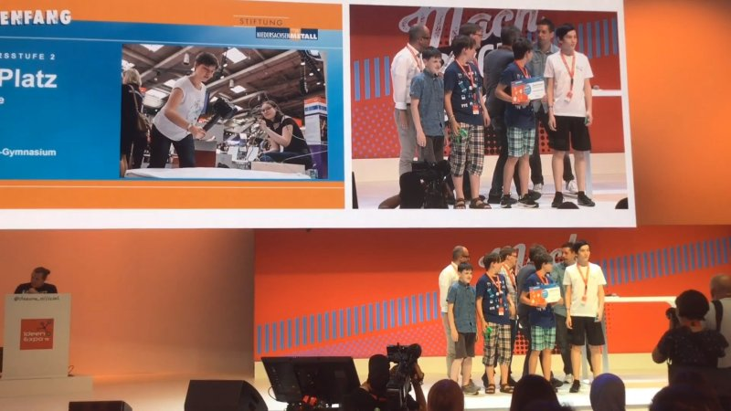
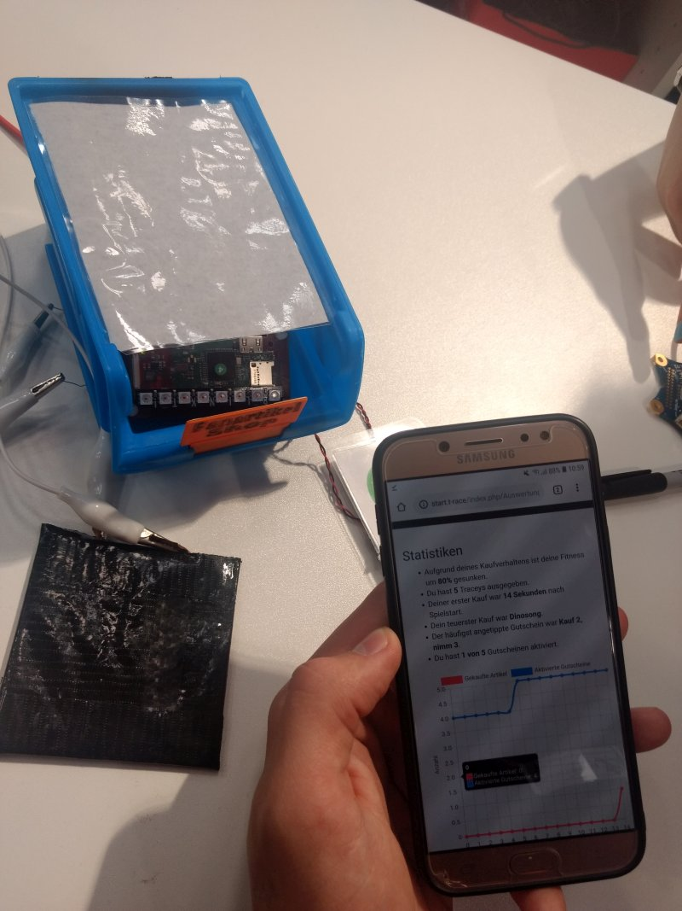
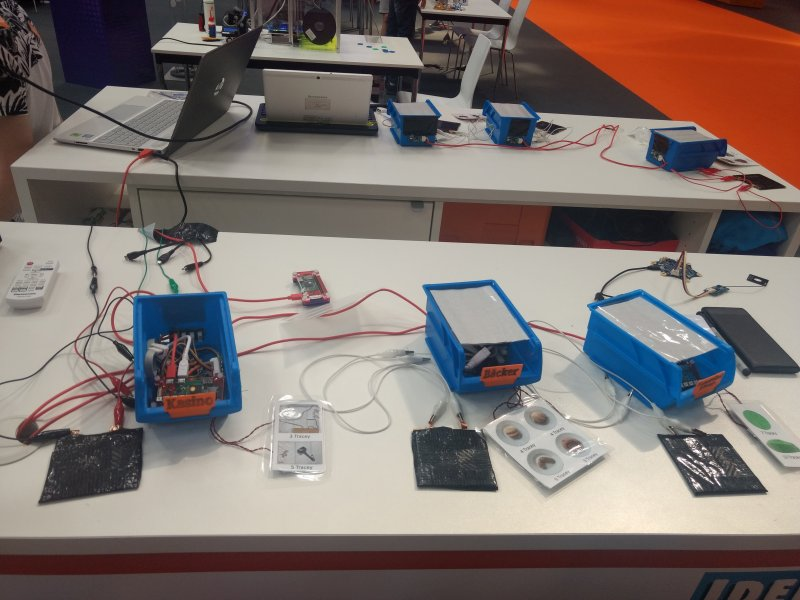

# T-Race: ein rasantes Spiel zum Thema Datenspuren!

Bezahlen mit Smartphone und drahtlosen Chipkarten wird immer beliebter. Doch welche Spuren hinterlässt man dabei? 
Mit dem eigenen Smartphone kann im rasanten Spiel T-Race die eigene Datenspur entdeckt werden - komplett ohne Risiken 
und Nebenwirkungen: T-Race funktioniert mit einem lokalen WLAN-Hotspot und Webserver, der keine Verbindung ins Internet 
ermöglicht!

## Zum Hintergrund des Spiels
Das Spiel wurde im Schuljahr 2018/2019 in der Medienscout AG des [Lessing-Gymnasiums Uelzen](https://www.leg-uelzen.de) entwickelt und ist mit &#x2764; für den Einsatz im Schulunterricht gestaltet und erprobt worden. 

T-Race ist das Gewinnerprojekt des Ideenfang-Wettbewerbs auf der [IdeenExpo 2019](https://www.ideenexpo.de) in der 2. Altersgruppe! 

Hier ist das Video der Preisverleihung: 

## Impressionen
Abb. links: T-Race Shops auf der IdeenExpo 2019.

Abb. rechts: ein Spieler mit Smartphone schaut sich seine Spielergebnisse an. 
</img> </img>

## Ideenfang-Variante
Wer das Spiel im Unterricht einsetzen möchte, verwendet in der **Ideenfang-Variante** ein paar Calliope mini mit externen Sensoren für NFC-Karten und Multitouch sowie ein paar Raspberry Pi Zero mit Zubehör, wie Blinkt! Modulen. Zusätzlich wird ein MakeyMakey benötigt. Für die Shopartikel können kleine Objekte mit einem 3D-Drucker und einem Schneideplotter angefertigt werden. Für eine Neuanschaffung ist diese Variante die teuerste.

- [Dokumentation Ideenfang-Variante](docs/ideenfang_variante.md)
- [Dokumentation Spielkarten-App](docs/spielkarten_app.md)
- [Anleitung Spielleitung](docs/spielleitung.md)
- [Anleitung Spieler](docs/spielanleitung.md)
- [Spoiler Spielende](docs/spielende.md)
- [Goodies nicht nur für Lehrkräfte](docs/goodies.md)

Für die **low budget-Variante** arbeiten wir zur Zeit daran, günstigere Hardware wie Arduino Nano, ESP8266 und STM32F103C8T6 zu programmieren und zu testen. Das klingt noch sehr kompliziert, wird aber wirklich viel günstiger! Und wir dokumentieren das natürlich auch gut. 😉

