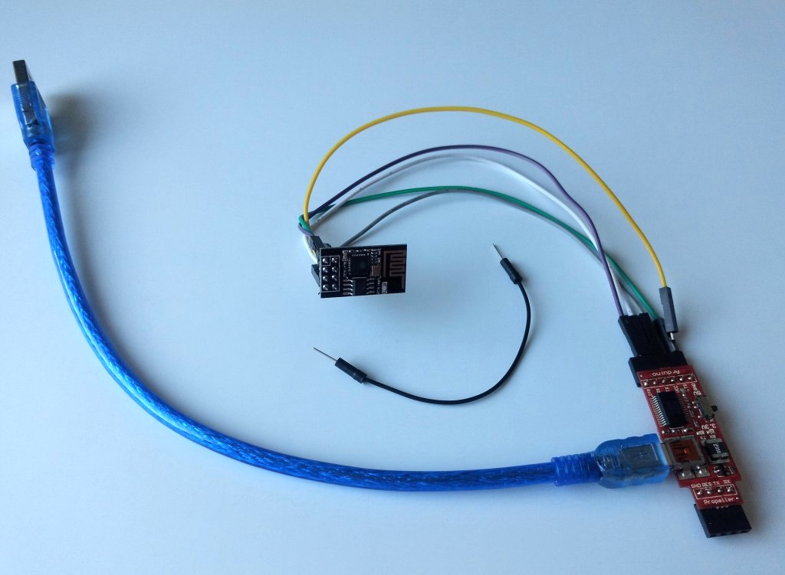

# ESP8266-Anpassung
Um den ESP8266 zu flashen, in der T-Race low-cost-Variante wird ein ESP8266-01S verwendet, haben wir einen FTDI-Adapter verwendet.
Der ESP wird per Jumperkabel an den Buchsen des FTDI-Adapters für 3.3V VCC, GND, RX, TX verbunden. Auf 3.3V ist zu achten sowie auf die korrekte Verbindung von TX/RX und RX/TX.

</img>

Nach Installation des FTDI-Treibers, falls notwendig, kann bspw. puTTY unter Windows oder die serielle Konsole der Arduino IDE verwendet werden, um seriell mit dem ESP zu kommunizieren.
Die aktuelle Versionsinfo erhält man mit dem Befehl `AT+GMR`.

</img>

## Firmware aktualisieren
Im Wesentlichen wurde die Flash-Anleitung von [AZ Delivery](https://www.az-delivery.de/blogs/azdelivery-blog-fur-arduino-und-raspberry-pi/firmware-flashen-esp8622-01s) verwendet, jedoch haben wir ein aktuelleres SDK (3.0.4) verwendet: [Download von Espressif ESP8266 NONOS SDK 3.0.4](https://github.com/espressif/ESP8266_NONOS_SDK/archive/v3.0.4.zip)

Die Einstellungen sind mit denen der Flash-Anleitung, bis auf die Dateinamen in den vier Zeilen, identisch:

1. Zeile: `ESP8266_NONOS_SDK-3.0.4\bin\esp_init_data_default_v08.bin`
2. Zeile: `ESP8266_NONOS_SDK-3.0.4\bin\blank.bin`
3. Zeile: `ESP8266_NONOS_SDK-3.0.4\bin\boot_v1.7.bin` 
4. Zeile: `ESP8266_NONOS_SDK-3.0.4\bin\at\512+512\user1.1024.new.2.bin`

Siehe auch folgender Screenshot, lediglich der COM-Port kann anders sein.
</img>

Zum Flashen muss neben 3.3V VCC, GND, RX, TX zwischen ESP und FTDI-Adapter zusätzlich GPIO0 mit GND verbunden werden!
Im FlashTool klickt man nach den Einstellungen auf Start, schließt mit einem Stück Draht RST an GND kurz und und löst die Verbindung wieder.
Anschließend startet der Flashvorgang.

## Baudrate dauerhaft ändern
Da der Arduino Nano per SoftwareSerial mit dem ESP8266 kommuniziert, ist die Baudrate des ESPs von 115200 für den Nano zu schnell und muss dauerhaft auf 9600 gedrosselt werden. Die Geschwindigkeit reicht für T-Race in der Praxis völlig aus. Mit puTTY wird eine serielle Verbindung zum ESP aufgebaut und per `AT+UART_DEF=9600,8,1,0,0` die Übertragungsgeschwindigkeit dauerhauft auf 9600 Baud gesetzt.

## SSID ändern

Ab einer Firmware-Version 2.1.0 kann der Hostname von ESP_irgendwas geändert werden in Baecker, Fanshop, und so weiter, wobei irgendwas die letzten Bytes der MAC-Adresse sind. Nach unserer Erfahrung werden die ESPs aber mit älterer Firmware ausgeliefert, weshalb sie im vorherigen ersten Schritt aktualisiert werden musste. Die SSID wird nicht dauerhaft geändert, sondern beim Starten vom Arduino aus per AT-Befehl konfiguriert.

Wer den Hostnamen nicht ändern möchte, kommentiert also die entsprechende Zeile in den ino-Dateien einfach aus.
Der Hostname kann nicht dauerhaft gespeichert werden.

## Weiterführende Informationen
Siehe [AT Instruction Set 3.2.8](https://www.espressif.com/sites/default/files/documentation/4a-esp8266_at_instruction_set_en.pdf)
und [AT Command Examples](https://www.espressif.com/sites/default/files/documentation/4b-esp8266_at_command_examples_en.pdf).

