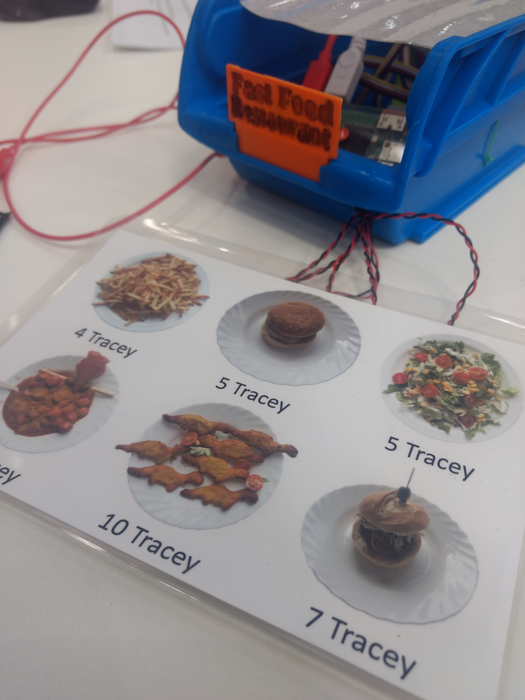

# Installation Fast Food-Restaurant

## Hardware

* Pi Zero W
* Blinkt! Modul
* Calliope mini
* Grove NFC
* Grove I2C Multitouch mit **sechs** Fühlern
* Grove I2C Hub
* Drei Grove Anschlusskabel
* Micro-USB-Kabel
* Micro-USB auf USB-Adapter
* Stromversorgung zu Pi Zero W
* Zwei Krokoklemmen (oder Drähte) und (selbstgebauter) Taster
* ausgedruckte und möglichst laminiertes [Artikelkarte](https://github.com/infchem/T-Race/blob/master/Shops/Shop-Artikel.pdf)
* Panzerband
* ggf. passendes, selbstgebautes Gehäuse

## Vorbereitung der Hardware
1. Der Pi Zero W wird entsprechend der Anleitung für alle Shops vorbereitet.
2. Mit einem Computer wird die Datei [mini-Fast-Food-Restaurant.hex](https://github.com/infchem/T-Race/blob/master/Shops/Fast%20Food-Restaurant/mini-Fast-Food-Restaurant.hex) auf den Calliope mini kopiert.
2. Der Calliope mini wird am linken Grove-Anschluss A0 per Kabel mit dem I2C Hub verbunden.
3. An den Hub werden Grove NFC und Grove I2C Multitouch per Kabel angeschlossen.
4. Der Calliope mini wird per USB-Kabel an den USB-Adapter und dann an den Pi Zero W angeschlossen.
5. Auf dem Pi wird das Blinkt! Modul gesteckt.
6. Die sechs Fühler werden wie folgt hinter die Artikelbilder geklebt:
* Fühler 0: Pommes
* Fühler 1: Fleischklopsbrötchen 
* Fühler 2: Veganer Salat
* Fühler 3: Dinokeule
* Fühler 4: Currywurst
* Fühler 5: Burger
8. An Pin P0 und dem Minuspol werden zwei Krokoklemmen oder Dähte angeschlossen und mit einem Taster verbunden.
