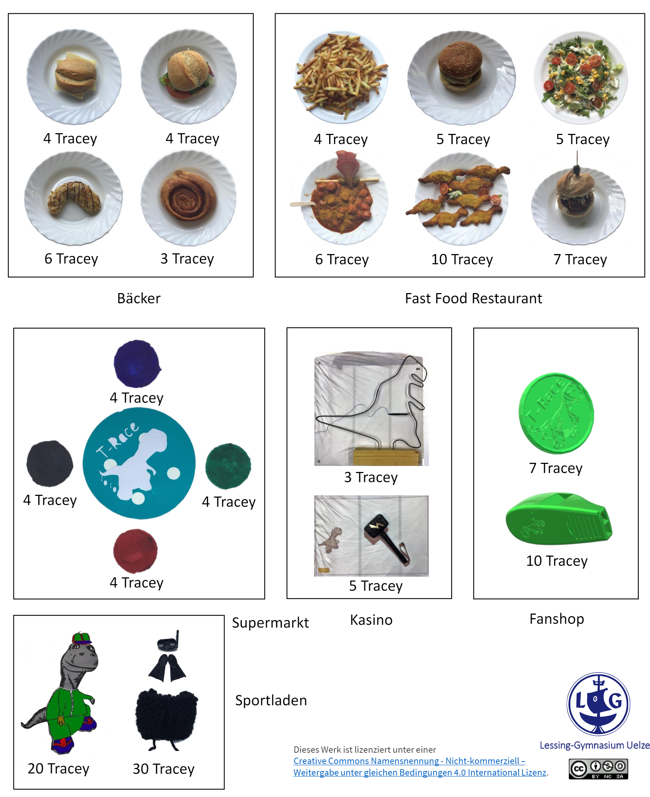
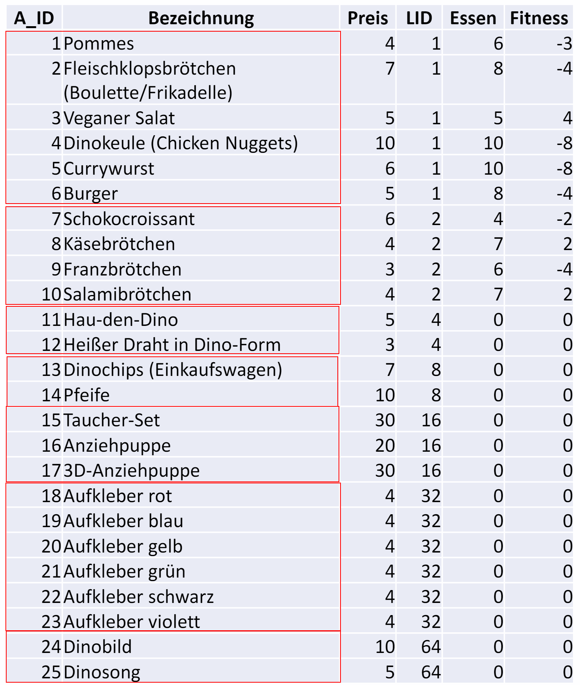

# Goodies in der T-Race Low-Cost-Variante

Bei der Spielerstellung sind die Artikelbilder und die Artikeltabelle hilfreich.

## Artikelbilder

</img>

## Artikeltabelle

</img>

Wusstest du schon, dass...

...es im Sportladen auch eine 3D-Anziehpuppe mit der Artikelnummer 17 gibt?

...es im Supermarkt den Aufkleber in zwei weiteren Farben gibt? Schwarz hat die Artikelnummer 22, Violett die 23.

