# T-Race in der Low-Cost-Variante

Da die Ideenfang-Variante nicht ganz so günstig ist, haben wir eine Low-Cost-Variante zusammengestellt.
Im Wesentlichen wird für die Shops günstigere Hardware verwendet. Statt eines Pi Zero W und eines Calliope mini kommen ein ESP8266 und ein Arduino Nano zum Einsatz. Statt Grove NFC und Multitouch Sensoren ein RC522 und einfache Drucktaster. Die Verkabelung erfolgt auf Steckbrettern, die gesamte Hardware wird in einem selbstgedruckten Gehäuse untergebracht, kann aber auch individuell verpackt werden.

Aufgrund des verwendeten Nano bezeichnen wir in dieser Variante die Shops als Nanoshops, um sie von der Ideenfang-Variante zu unterscheiden (da wäre der Name Minishops ganz passend, wegen der Calliope mini...). 

## Materialliste
Ein Spiel besteht aus einem Server, mehreren Shops und den Smartphones der Spieler. In der Low-Cost-Variante werden für Server und Shops insgesamt folgende Dinge benötigt:

### Server
- 1 RaspberryPi Zero W oder RaspberryPi 3 Mod. A+ (beide erfolgreich getestet)
- 1 Gehäuse (z.B. Pibow Case oder RASP 3A+ CASE RW)
- 1 Netzteil mit Micro-USB-Kabel (z.B. mit Ausgang 5V / 2.5A)
- 1 microSD Karte mit 32 GB (z.B. Sandisk Ultra 32GB)

### Nanoshops
#### Nanoshop-Steckbrett
- 6 Arduino Nano (oder kompatibel) mit USB/TTL-Chip (z.B. mit CH340)
- 6 ESP-01S mit Breadboard Adapter
- 6 Breadboard mini mit Stromschienen, 300/100 Kontakte
- 6 Spannungsversorgungs-Platine 3.3V / 5V für Breadboard (z.B. MB102)
- 6 Netzteil für MB102 (z.B. Rundstecker 5.5mm/2.1mm und mit Ausgang 9V / 660 mA)
- 6 Widerstand 1 kOhm
- 6 Widerstand 2.2 kOhm

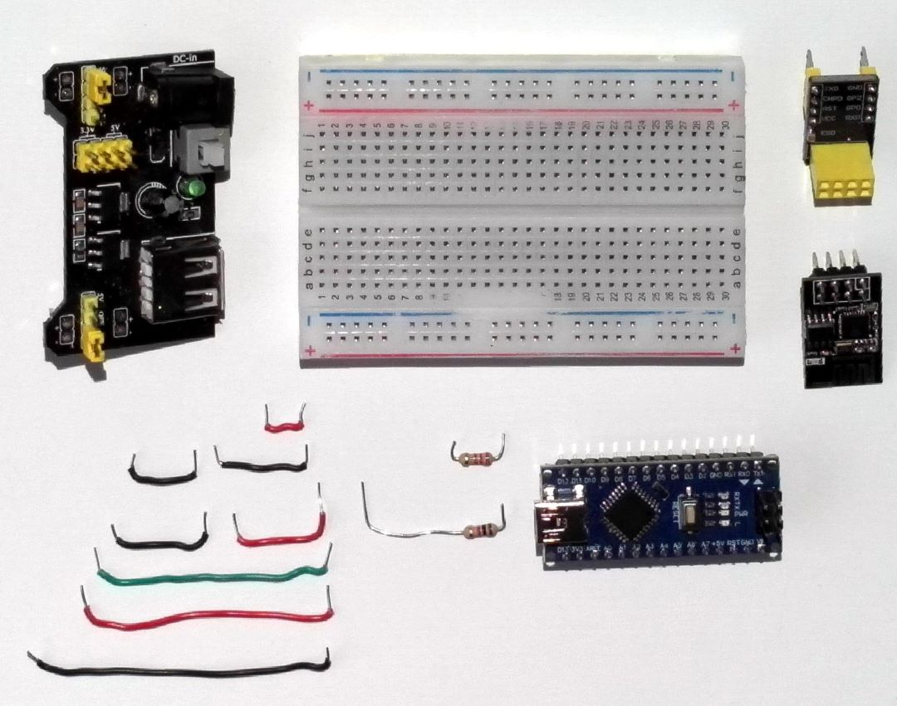</img>

#### Nanoshop-Platine
- 6 RC522 RFID-Kartenleser
- 26 Taster (z.B. Multimec 3FTH9 mit Printanschluss)
- 20 Kappe grün für Artikeltasten (z.B. Mec Switches 1D02)
- 6 Kappe rot für Kauftaste (z.B. Mec Switches 1D08)
- 6 RGB LED (z.B. KY-016)
- 6 "Experimentier-Platine" (79,1X51,1)
- 12 Buchsenleiste 2x5 pol gewinkelt
- 12 einzelne Steckerstifte für Masseverbindungen
- 1 Rolle Schaltdraht, bspw. YV 1X0.2 QMM

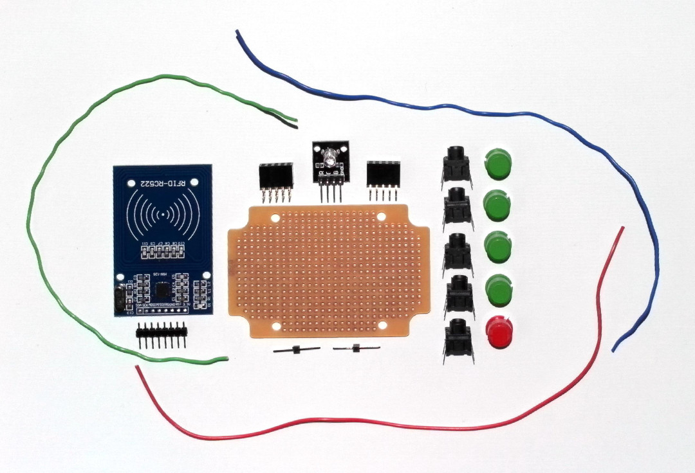</img>

#### Nanoshop-Gehäuse
- 3D-Drucker
- Filament
- 24 Büroklammern oder dünne Maschinenschrauben mit Muttern.

#### Sonstiges
- 1 Klassensatz RFID-Karten Typ Mifare Classic 1k 
- 1 USB-Kabel mit A-Stecker auf Mini-B-Stecker zum Programmieren der Nanos
- 1 FTDI-Adapter zum Flashen des ESP8266 und des STM32F103C8T6
- Laptop/PC zum Programmieren
- 3 A4-Seiten Farbausdrucke, am besten mit Laserdrucker auf Aufkleberpapier
- Seitenschneider, Vorbohrer, Rundfeile, Laubsäge, Flachzange
- ggf. Shopartikel (mit 3D-Druck und Schneideplotter herstellbar, siehe Ideenfang-Variante)

#### Kasino
Wenn mit realer Gamecontrollern gespielt werden soll:
- 1 STM32F103C8T6
- 12 Steckkabel mit Buchse
- 1 Adapter microUSB Stecker auf USB Typ A Buchse
- 1 USB A auf Micro USB-Kabel
- 1 Android Smartphone oder -Tablet mit Micro USB-Anschluss
- 1 Hau den Dino-Spiel für das Kasino
- 1 Heißer Dino-Spiel für das Kasino
- Kasino App
Ansonsten:
- 1 Smartphone oder Tablet mit Internetzugang

## Material vorbereiten
### Server

Für den Server auf Basis eines RaspberryPi Zero W gibt es eine separate [Anleitung](installation_server.md).
Diese funktioniert auch mit einem Raspberry Pi 3 Mod A+.

### Shops

Wir haben für die Low-Cost-Variante ein Gehäuse mit TinkerCAD erstellt und mit  3D-Druckern ausgedruckt. Im Bild ist unser erster Prototyp zu sehen. Der Deckel ist halbiert, weil bei einem der 3D-Drucker das Druckbett zu klein gewesen ist ;)

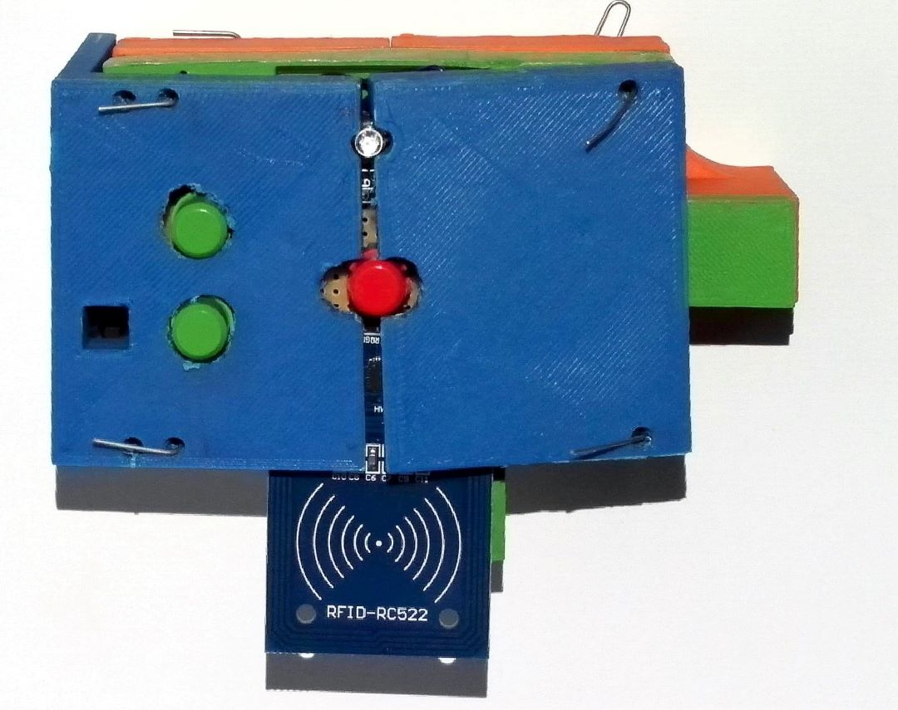</img>

#### Shop-Steckbrett
Für die Verkabelung des Nano mit dem ESP8266, dem Kartenleser, den Tastern und der RGB-LED gibt es eine [tabellarische Übersicht der Verkabelung](nanoshop_verkabelung_tabelle.md).

Achtung: Der Arduino Nano sendet von Pin D2 mit 5V seriell an den ESP8266 (Pin RXD), welcher mit 3.3V läuft. Um dauerhafte Schäden zu vermeiden, ist ein einfacher Spannungsteiler mit zwei Widerständen (1 kOhm, 2.2 kOhm) auf dem Steckbrett notwendig.

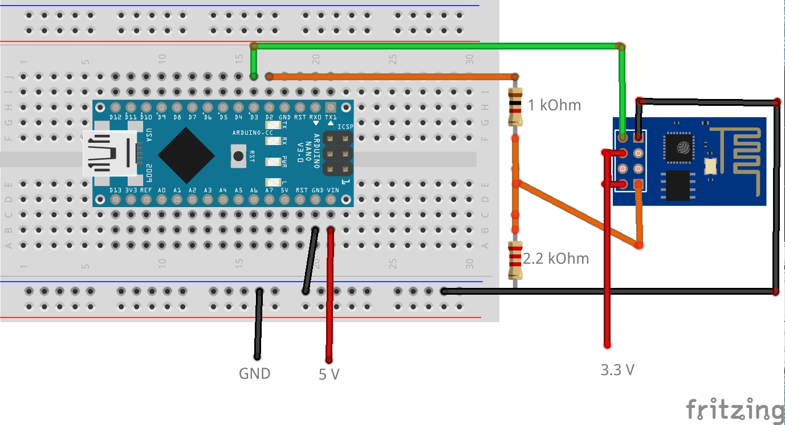</img>

##### Anpassen des ESP8266
Jeder ESP8266 muss einmalig angepasst werden in der seriellen Übertragungsgeschwindigkeit, mit der er mit dem Arduino Nano kommuniziert.
Zusätzlich kann nach einem Firmware-Upate die SSID geändert werden, mit der er sich am RasPi Hotspot anmeldet. 
Auch wenn die optionale SSID-Änderung einmalig mehr Aufwand für das Firmware-Update bedeutet, hat sie den Vorteil, dass man bei Netzwerk-Problemen viel einfacher in den Log-Dateien auf dem RasPi nachvollziehen kann, welcher Shop die Probleme verursacht oder gar nicht verbunden ist.
Für die Anpassungen des ESP8266 gibt es eine eigene [Infoseite](esp8266_anpassung.md).

##### Flashen des Arduino Nano
Um die Programme auf den Arduino Nano zu übertragen, werden mit der [Arduino IDE](https://www.arduino.cc/en/Main/Software) folgende INO-Dateien verwendet:

-  [Bäcker](Nanoshops/nano-Baecker/nano-Baecker.ino)
-  [Fanshop](Nanoshops/nano-Fanshop/nano-Fanshop.ino)
-  [Sportladen](Nanoshops/nano-Sportladen/nano-Sportladen.ino)
-  [Fast Food-Restaurant](Nanoshops/nano-Fastfood/nano-Fastfood.ino)
-  [Kasino](Nanoshops/nano-Kasino/nano-Kasino.ino)
-  [Supermarkt](Nanoshops/nano-Supermarkt/nano-Supermarkt.ino)

Je nach Seriell-zu-USB-Chip muss zuvor ein Treiber installiert werden, beispielsweise für [Nanos mit CH340-Chip unter Windows diesen Treiber](http://www.wch.cn/downloads/file/65.html), bevor der passende COM-Port in der Arduino IDE ausgewählt werden kann.

#### Shop-Platine
Wir haben in der Low-Cost-Variante die Taster und RGB-LED auf einer kleinen Platine verlötet und verkabelt. Über zwei 2x5 Buchsenleisten kann dann mit Schaltdraht die Verbindung zwischen den Komponenten und dem Steckbrett erfolgen, das unterhalb der Platine in dem selbstgedruckten Gehäuse untergebracht ist. Die Anordnung der Bauteile auf dem "Experimentier-Platine" ist wie folgt:

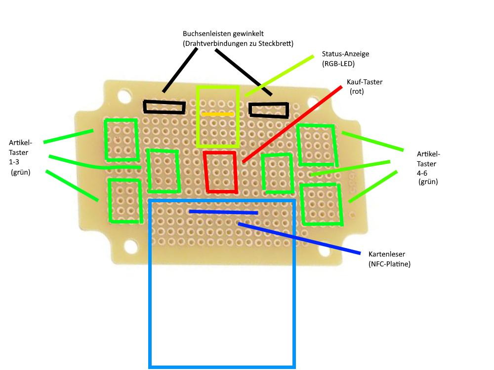</img>

Vorderseite der Shop-Platinen für 2, 4 sowie 6 Artikel

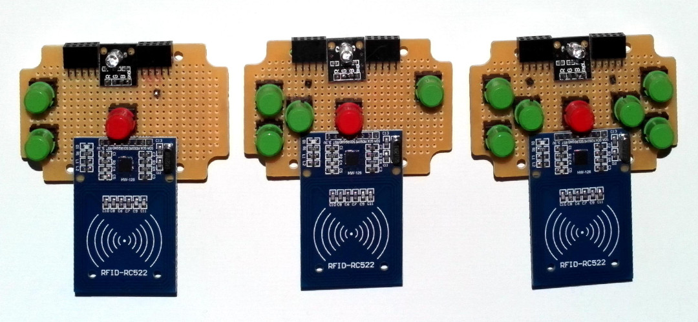</img>

Rückseite der Shop-Platinen für 2, 4 sowie 6 Artikel

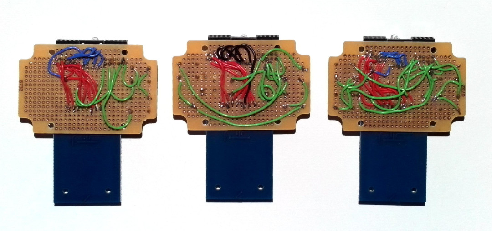</img>

#### Shop-Gehäuse
</img>

Für den 3D-Druck haben wir ein [Shopgehäuse](https://www.tinkercad.com/things/a3K8FNhCdQt-shopgehause) konstruiert, das aus mehreren Einzelteilen zusammengesetzt wird:
- [Deckel](https://www.tinkercad.com/things/cM0xGbWPIT4-deckel)

Hinweise zur Deckelanpassung weiter unten beachten!

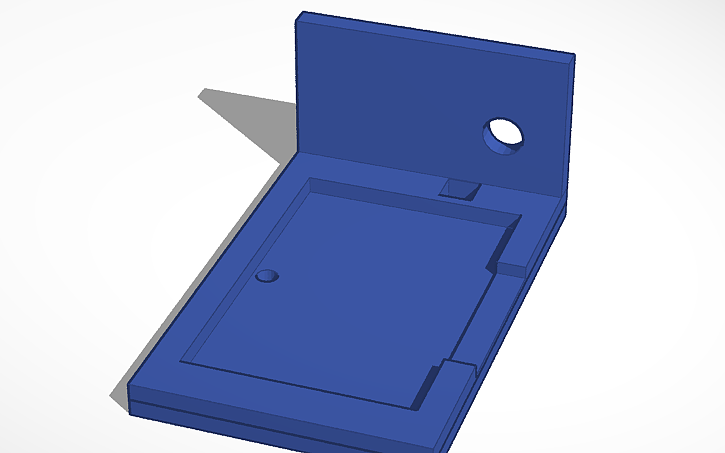</img>
- [Seitenteile](https://www.tinkercad.com/things/68AJnJnZl2z-seitenteile)

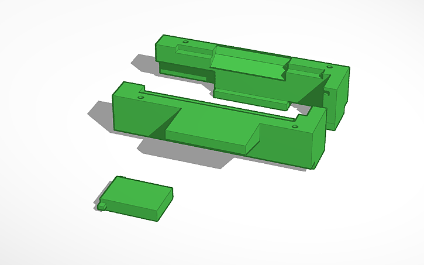</img>
- [Boden](https://www.tinkercad.com/things/552M8pxVZd9-boden)

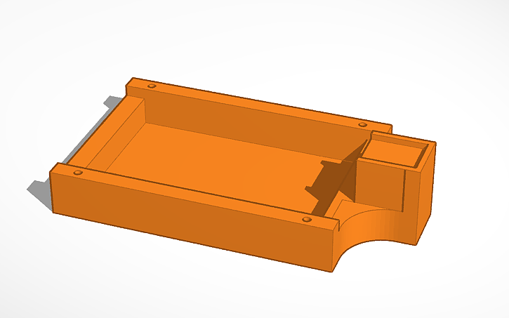</img>
- [Boden gesteckt](https://www.tinkercad.com/things/6OpHhRXOJyb-boden-gesteckt)

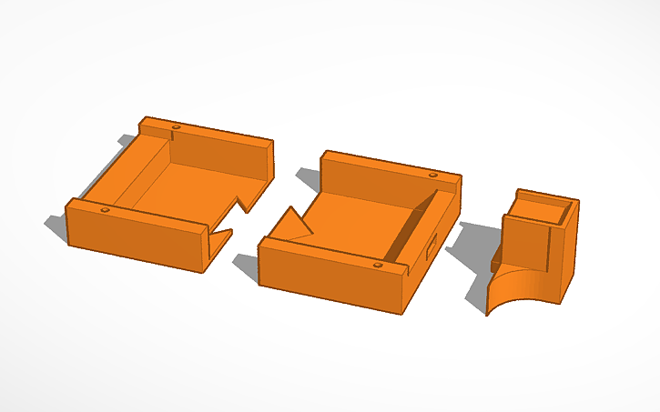</img>

Um beim zusammengebauten Gehäuse den Einschalter der Platine zur Spannungsversorgung zu drücken, aber nicht versehentlich auszudrücken, gibt es hierzu einen ["Spezialdrücker"](https://www.tinkercad.com/things/7KHX2bZ1ykE-drucker).

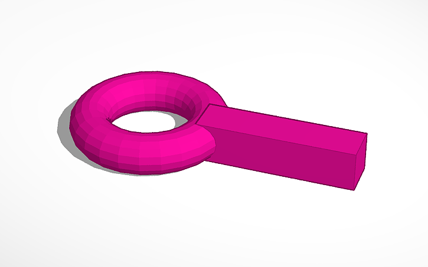</img>

##### Anpassung des Deckels
Da die Shops unterschiedlich viele Artikeltaster haben (4x 2, 2x 4, 1x6), haben wir den Deckel aktuell noch ohne Löcher konstruiert. Entweder bohrt man diese mit einem Vorbohrer, dann einer Laubsäge und anschließend einer Rundfeile passgenau, oder man bearbeitet den Deckel in einer CAD-Software wie TinkerCAD so, dass die Löcher gleich "mitgedruckt" werden. Den Kauftaster nicht vergessen!

Ebenfalls fehlen im Deckel die vier kleinen Löcher für die Endmontage, die mit einem Vorbohrer leicht ergänzt werden können:
Die Montage erfolgt durch die dünnen Löcher mit Büroklammern, die erst gerade gebogen, dann durch die dünnen Löcher durchgesteckt, und dann wieder umgebogen werden (oben und unten). Je Shop sind vier Büroklammern nötig. Alternativ können dünne (M2) Maschinenschrauben mit Muttern verwendet werden. 

Wenn wir Zeit finden, werden die drei Varianten des Deckels nachgereicht. ;)

#### Zusammenbau Shopgehäuse

Die folgende Bilderreihe zeigt den Zusammenbau des Nanoshops mit unserem Gehäuse. Es handelt sich um den Prototypen, daher hat der Deckel handgebohrte Löcher. Er ist halbiert, weil einer unserer 3D-Drucker eine zu kleine Druckplatte hat. Zum Fixieren weurden aufgebogene Büroklammern verwendet und noch keine Maschinenschrauben. Das Filament wurde mit zu kaltem Druckbett gedruckt und hat daher gewarpt (Ecken sind nach oben verzogen).

Die Nanoshop-Gehäuseteile

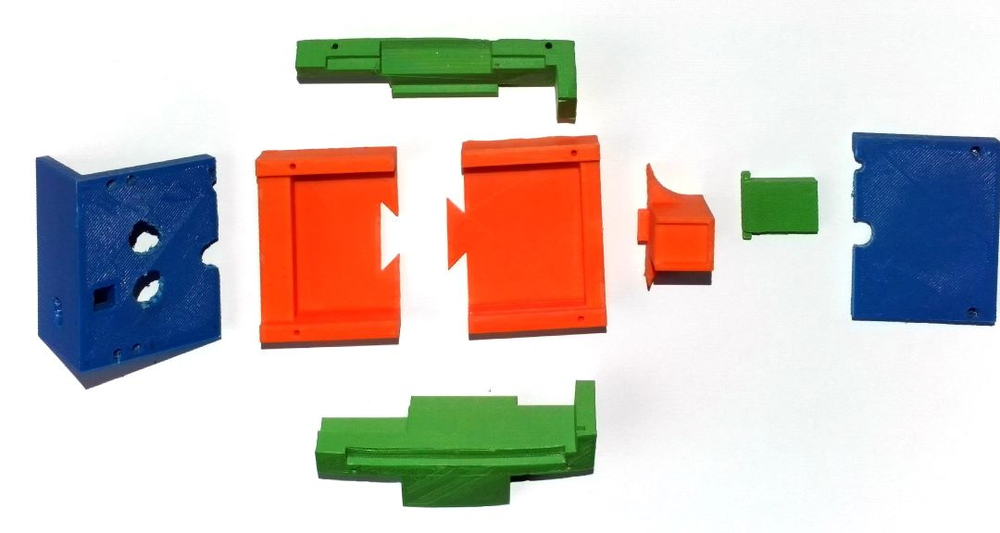</img>

Das Nanoshop-Steckbrett

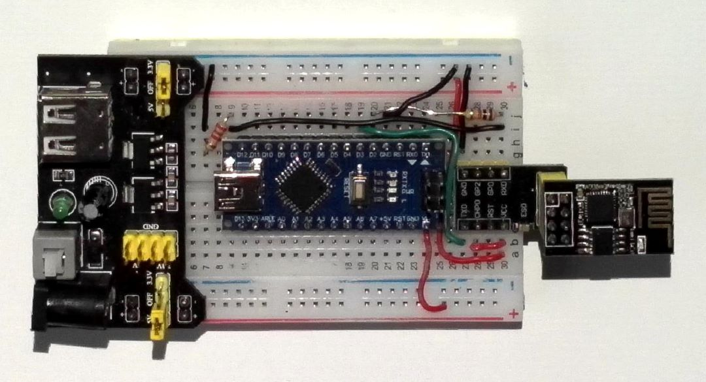</img>

Das Steckbrett im Unterteil

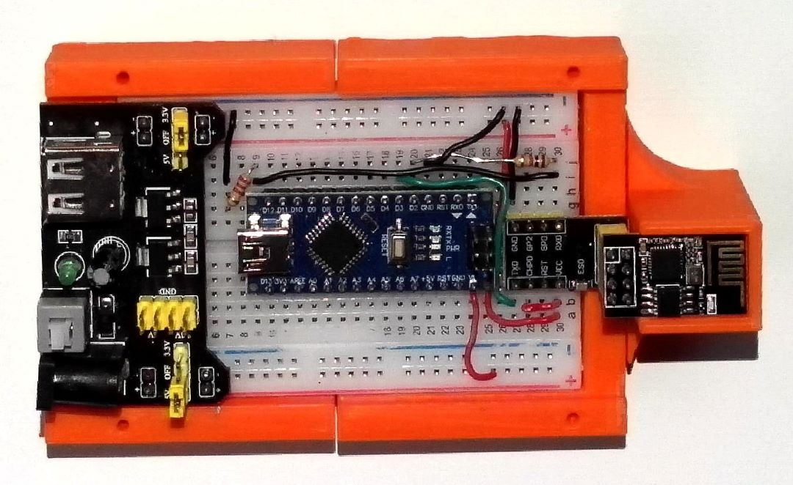</img>

Die montierten Seitenteile

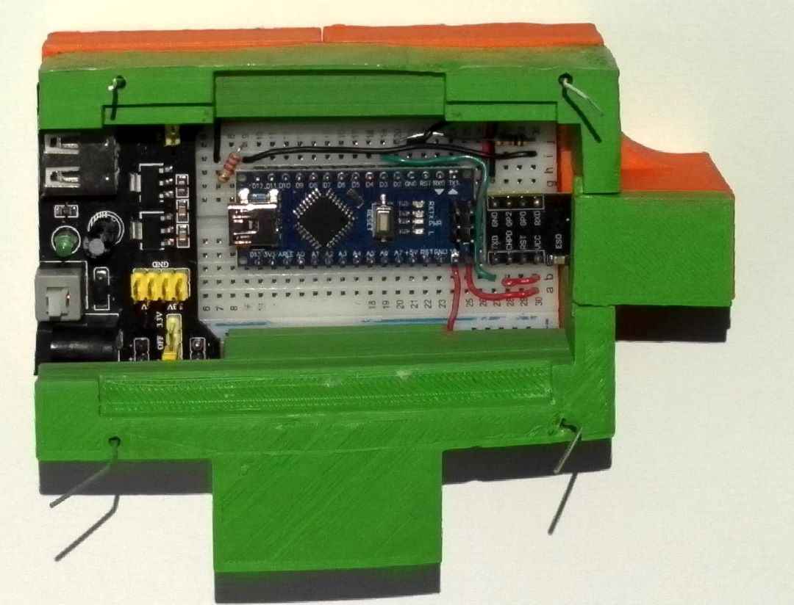</img>

Die verkabelte Nanoshop-Platine

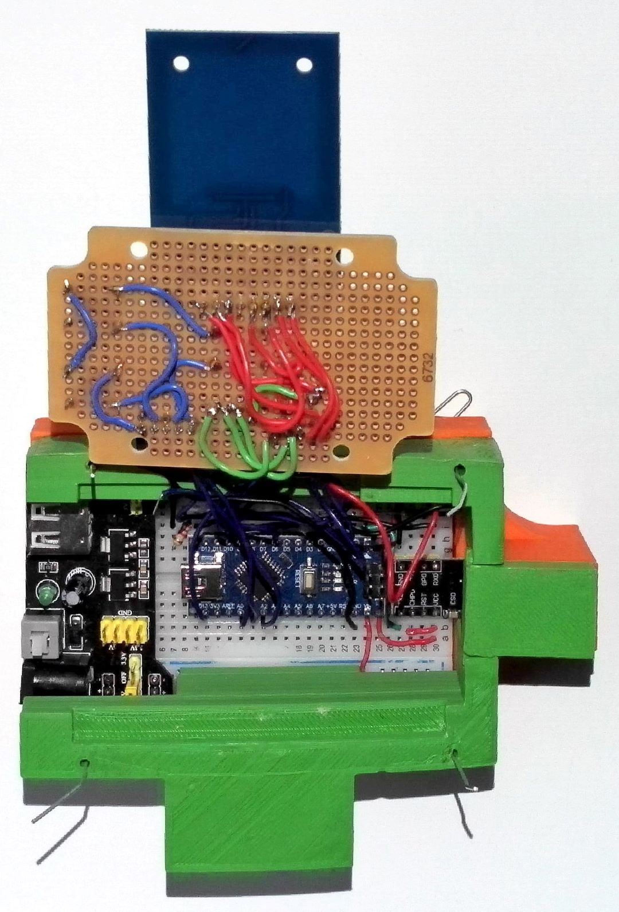</img>

Die eingepassste Platine

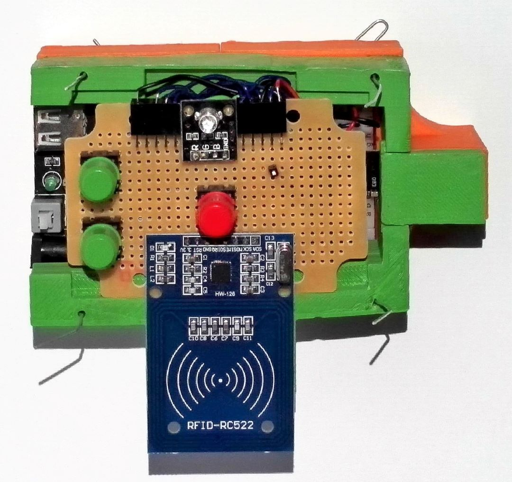</img>

Die Montage des Deckels

</img>

Der Prototyp in der Seitenansicht

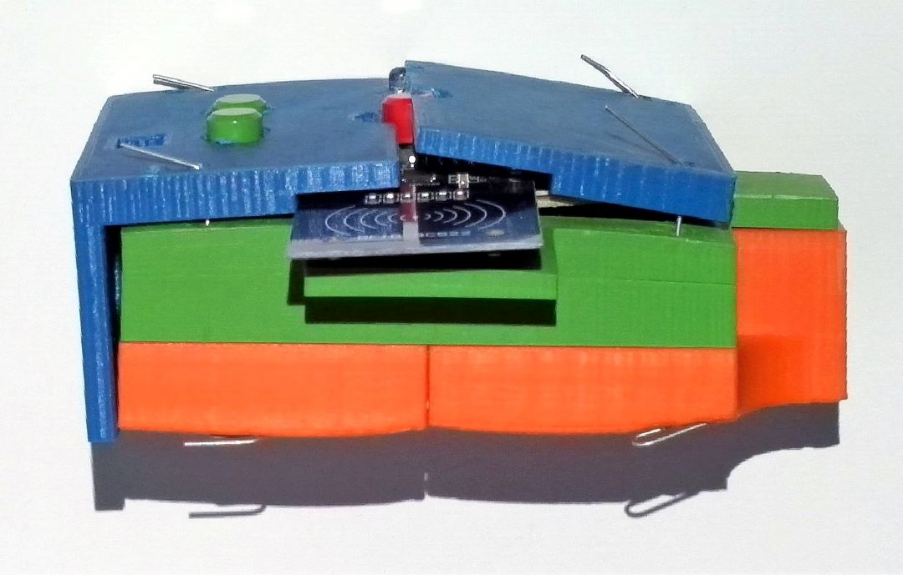</img>

Bilder eines sauber gedruckten Nanoshops reichen wir bei Gelegenheit nach!

#### Nanoshop-Aufkleber und Artikelbilder

Während in der Ideenfang-Variante die Touchsensoren direkt hinter den Artikelbildern liegen, müssen in der Low-Cost-Variante Taster ohne Bebilderung gedrückt werden. Für die Nanoshop-Deckel haben wir daher Aufklebervorlagen erstellt mit T-Race-Logo und Nummerierung der Tasten. Die größeren Kreise sind die Löcher für die Taster und müssen an die passende Stelle vor dem Ausdruck verschoben werden. Das Kästchen ist das Loch für den Einschalter, der kleine Kreis ist für die RGB-LED vorgesehen.

Um die Zuordnung der Artikeltasten zu den jeweiligen Shopartikeln zu vereinfachen, haben wir die Artikelschilder aus der Ideenfang-Variante mit den passenden Ziffern versehen, die auch auf den Shop-Aufklebern zu finden sind. 

Drei der sechs Nanoshop-Aufklebervorlagen

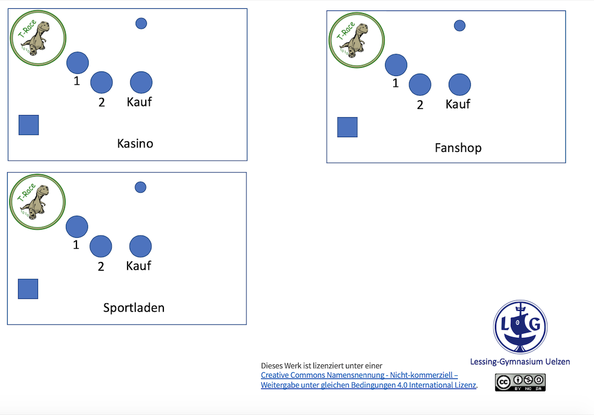</img>

Drei der sechs nummerierten Nanoshop-Artikelbilder

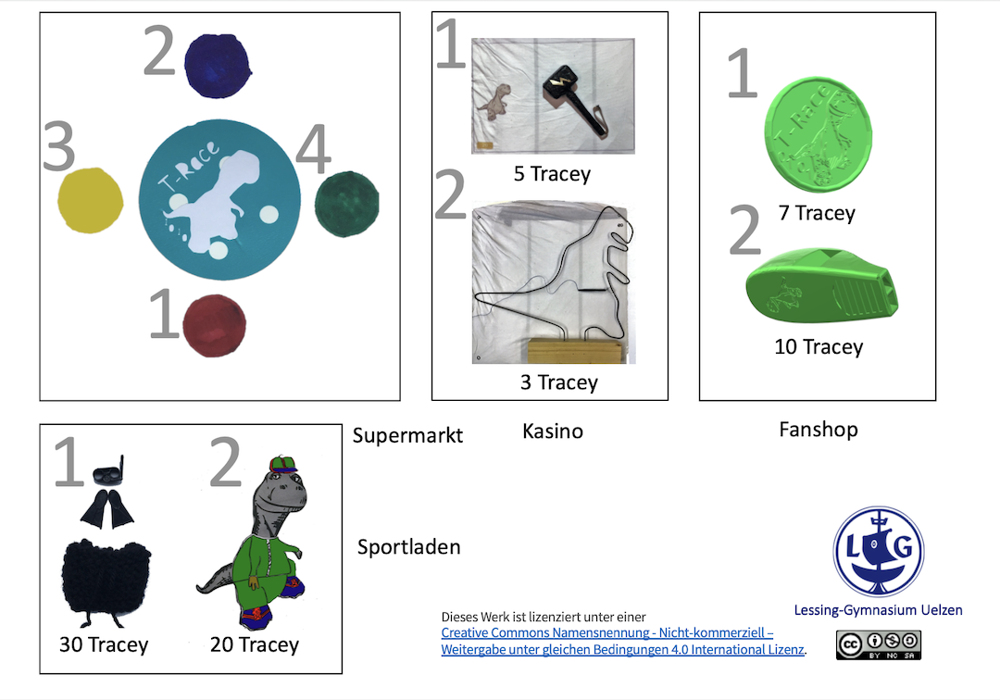</img>

Artikelschilder und Shopaufkleber gibt es im [PPTX-Format](../Nanoshops/Nanoshop-Artikel.pptx) und im [PDF-Format](../Nanoshops/Nanoshop-Artikel.pdf).

### Kasino

folgt.