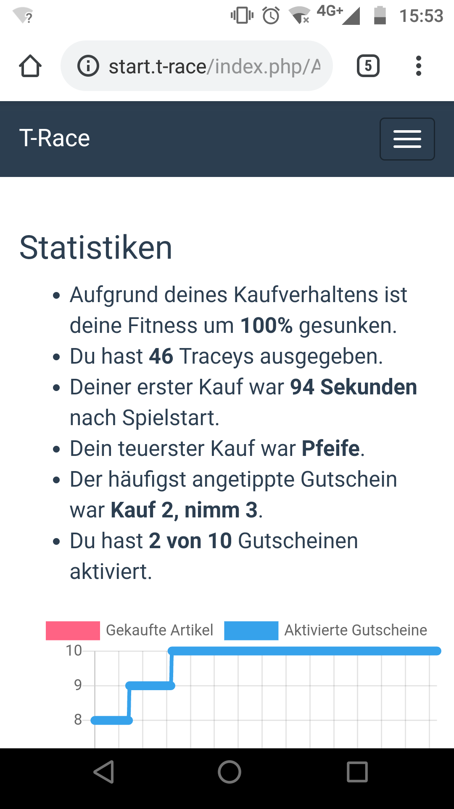
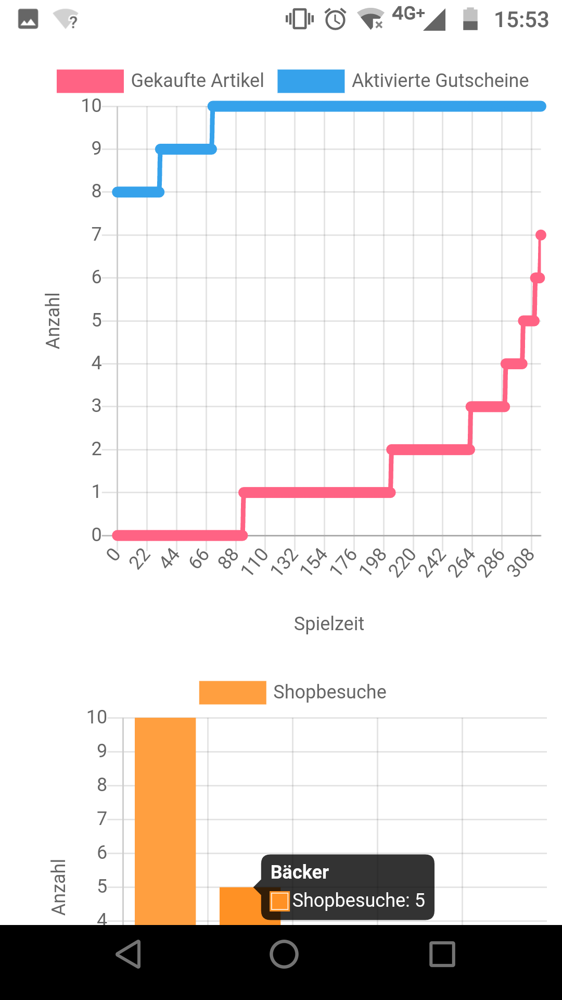
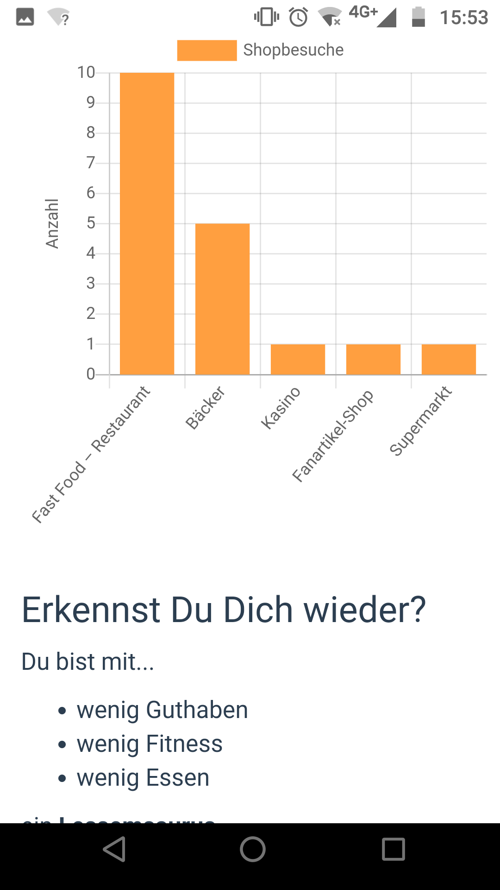
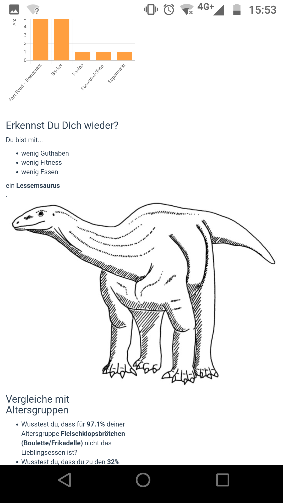
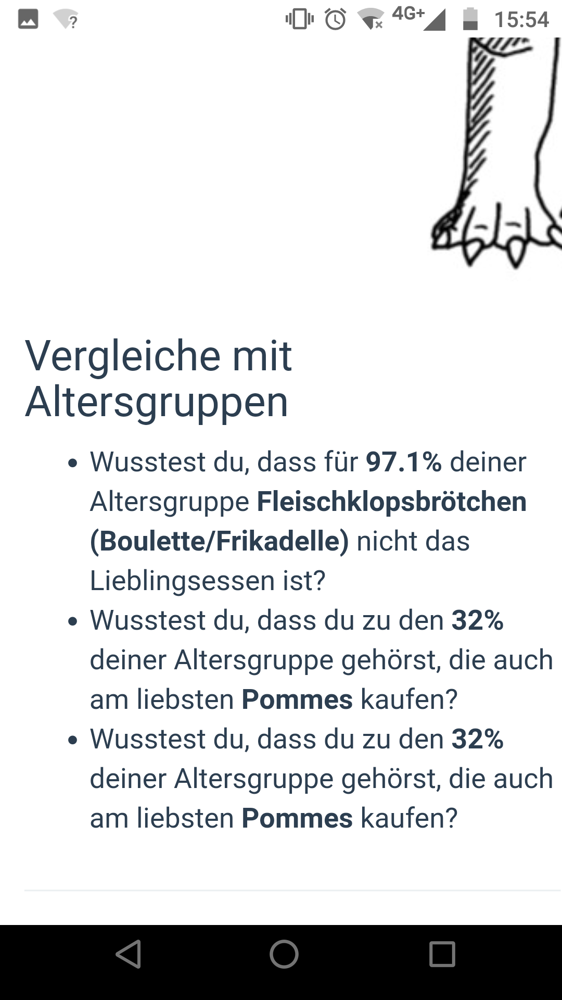

# Spoiler T-Race Spielende
Wenn Essen, Fitness oder Guthaben auf 0 gesunken sind, stirbt der Spieler.
Im Regelfall hat er bis dahin verschiedenste Artikel gekauft und möglichst passende Gutscheine eingelöst,
um günstig und schnell die Werte im Spiel zu steigern. Doch wie hat er insgesamt abgeschnitten? Am Ende des Spiels erscheint
ein Steckbrief über sein Konsumverhalten, in dem er einen von sieben möglichen Dinosauriern zugeordnet wird.
Und noch mehr wird dem Spieler vorgeführt: Insgesamt 763 SchülerInnen und LehrerInnen des Lessing-Gymnasiums Uelzen haben
in einer anonymem Umfrage rückgemeldet, wie sie im Spiel entscheiden würden. Daraus und aus der Altersangabe des Spielers wird
im Steckbrief "gnadenlos" aufgeführt, wie seine Altersgruppe im direkten Vergleich entschieden hat. Echte Datenspuren eben!

Ein Spieler-Steckbrief ist in den folgenden Screenshots zu sehen:
 
 
