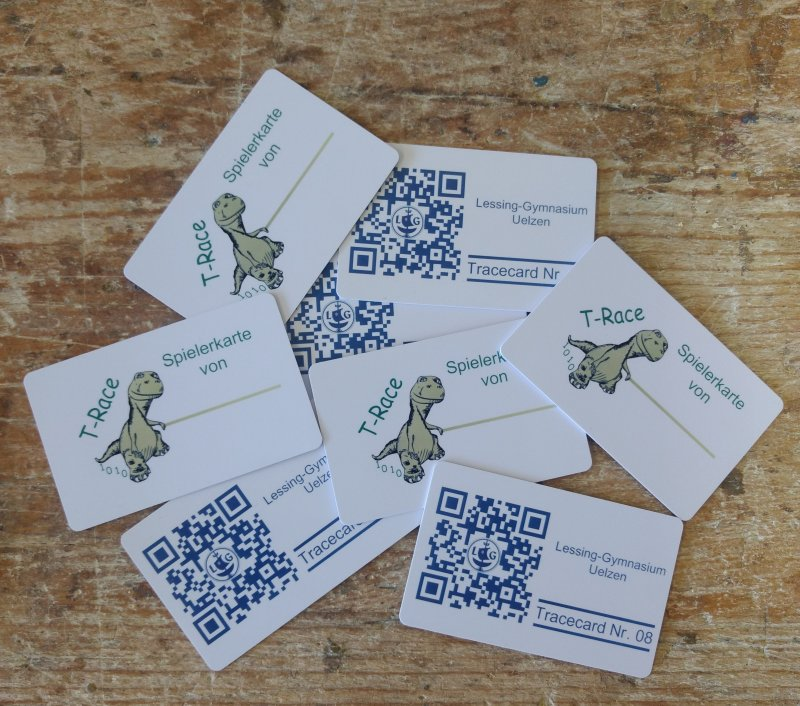

# T-Race Spielkarten-App (nur Android)

Auf der Spielkarte wird die Spielernummer gespeichert, die der Spieler bei der Registrierung erhält.
Die Spielernummer wird automatisch als sogenannter Primärschlüssel in der Datenbank vergeben und ist eindeutig. 
Sie wird nicht im Browser auf dem Smartphone des Spielers angezeigt, sondern muss mit der T-Race Spielkarten-App ermittelt werden.
Die App ist nur für Android und nicht in Google Play verfügbar. 
Die App kann in zwei Varianten verwendet werden, wobei der Wechsel nur im [MIT App Inventor](http://ai2.appinventor.mit.edu/) mit der 
[AIA-Projektdatei](../Sonstiges/Spielerkarte/T_Race_Spielerinfo.aia) möglich ist, siehe unten.
In der vorbereiteten Variante wird mit Hilfe der App die Nummer ausgelesen und mit einem Calliope mini und Grove NFC auf die Karte geschrieben.

## Materialliste
- 1 Android Smartphone oder Tablet für die Spielleitung
- 1 Calliope mini
- 1 Grove NFC mit Verbindungskabel
- 1 Batteriepack, alternativ Powerbank mit Micro USB-Kabel
- mehrere NFC-Karten

## Materialvorbereitung
### App
Zum Installieren der App auf dem Smartphone oder Tablet der Spielleitung geht man wie folgt vor:
1. Installieren aus unbekannten Quellen in den Systemeinstellungen zulassen.
2. Kopieren der [APK-Datei](../Sonstiges/Spielerkarte/T_Race_Spielerinfo.apk?raw=true) auf das Gerät.
3. Installieren der APK-Datei durch Öffnen und Bestätigen der Sicherheitsabfrage.

### Calliope mini
1. Der Grove NFC wird mit dem Verbindungskabel an die linke Grove-Buchse A0 des Calliope mini angeschlossen.
2. Die [HEX-Datei](../Sonstiges/Spielerkarte/mini-Spielerkarte.hex?raw=true) zum Einstellen der Spielernummer und Beschreiben der NFC-Karte wird auf den Calliope mini kopiert.
 
## Verwendung der App mit Calliope mini

1. Das Smartphone wird mit dem T-Race Hotspot verbunden.
2. Der Calliope mini wird mit dem Batteriepack oder einer Powerbank verbunden und eingeschaltet.
3. Nachdem sich ein Spieler registriert hat, kann der Spielername (nicht Vorname/Name) in das entsprechende Feld der App eingegeben und die Spielernummer abgerufen werden.
4. Durch Einschalten des Calliope mini wird ein interner Zähler auf 0 gesetzt und angezeigt. Durch Drücken der Taste A erhöht sich der Wert um 1 und die Anzeige wird aktualisiert.
5. Ist die gewünschte Spielernummer eingestellt, wird die Spielerkarte auf die Antenne des Grove NFC mittig gelegt und die Taste B gedrückt.
Ein Quadrat erscheint im Display und die Spielernummer wird auf die Karte gespeichert. Leuchtet das Quadrat verhältnismäßig lange auf,
 hat das Schreiben nicht geklappt. Oft liegt die Karte nicht richtig auf der Antenne auf, selten ist das Verbindungskabel lose.

## Wechsel der Betriebsart
Wenn das Smartphone oder Tablet der Spielleitung NFC-fähig ist, kann im [MIT App Inventor](http://ai2.appinventor.mit.edu/) mit der 
[AIA-Projektdatei](../Sonstiges/Spielerkarte/T_Race_Spielerinfo.aia) der Code so geändert werden, dass das Schreiben auf die Spielkarte direkt
mit dem Gerät erfolgt. Ein Calliope mini mit Grove NFC ist dann nicht mehr nötig. Die notwendigen Änderungen am Code stehen in den 
Notizen des App Inventor-Projekts, wenn es in der Programmierumgebung geladen ist.

### Verwendung der App ohne Calliope mini
1. Das Smartphone oder Tablet wird mit dem T-Race Hotspot verbunden.
2. Am Smartphone odeR Tablet wird die NFC-Funktion aktiviert.
3. Nachdem sich ein Spieler registriert hat, kann der Spielername (nicht Vorname/Name) in das entsprechende Feld der App eingegeben und die Spielernummer abgerufen werden.
4. Nun drückt man auf den entsprechend beschrifteten Button, um die Spielernummer auf die Karte zu schreiben.
5. Die Spielkarte wird dort an das Gerät gehalten, wo die interne NFC-Antenne verbaut ist (oft am oberen Rand oder in den oberen Ecken zu finden).
 Ist das Schreiben erfolgreich, wird eine entsprechende Meldung in der App ausgegeben.
