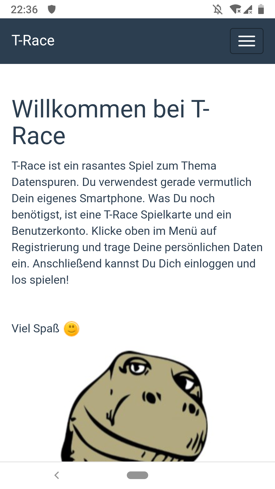
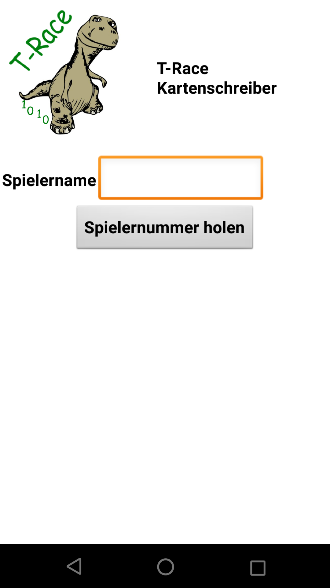

# Spielleitung

Die Spielleitung hat folgende Aufgaben

1. Briefen der Spieler, wie man sich mit dem Server verbindet, im Spiel registriert und was Allgemein zu beachten ist.
2. Briefen der Spieler, wie Artikel gekauft werden.
2. Ausgeben der Spielkarte mit der individuellen Spielernummer
3. Moderieren des Kasinos

## Spieler briefen (Allgemeines)
In der [Spielanleitung für Spieler](spielanleitung.md) stehen die wichtigsten Infos zum Verbinden, Registrieren und Spielen.
Empfehlenswert ist, dass die Spielleitung die Infos auswendig lernt oder den Spielern vorliest. Zum Verbinden bei mehreren 
gleichzitig Spielenden kann eine vorbereitete [Kurzanleitung mit QR-Code](../Sonstiges/Startinfo.pdf?raw=true) ausgedruckt 
und ausgelegt werden.

Die Webseiten von T-Race im Spielablauf sind:

Abb. links: Die Startseite von T-Race / Abb. rechts: Das geöffnete Menü
</img> </img>

Abb. links: Die Registrierungs-Seite / Abb. rechts: Die Login-Seite
</img> </img>

Abb. links: Die Spielseite / Abb. rechts: Die Gutschein-Seite
</img> </img>

## Spieler briefen (Artikelkauf)
1. Zuerst muss das gewünschte Artikelbild mit einem Finger angetippt (=der entsprechende Fühler berührt) werden.
2. Anschließend wird die Spielerkarte auf die NFC-Antenne aufgelegt. Bei der Shopbox-Variante wird die Karte vor der 
Kastenrückwand eingeschoben.
3. Der Kauf wird durch Drücken des Tasters (Verbinden von P0 mit Minuspol) bestätigt.
4. Die Spielernummer wird nun aus der NFC-Karte ausgelesen und seriell an den Pi übertragen, welcher die Kaufdaten per WLAN 
an den zentralen Server schickt. Hat die Buchung geklappt, leuchten die LEDs grün auf am Blinkt! Modul und am Calliope mini auf.
Hat die Buchung nicht geklappt, leuchten die LEDs rot auf.

## Spielerkarte ausgeben
Die Spielkarten-App kann entweder auf einem Smartphone/Tablet ohne NFC-Unterstützung und mit einem Calliope mini mit Grove NFC (Variante A) 
oder mit einem Smartphone/Tablet mit NFC-Unterstützung gespielt werden (Variante B).

### Variante A: Smartphone/Tablet und Calliope mini mit Grove NFC
1. Das Smartphone wird mit dem T-Race Hotspot verbunden.
2. Der Calliope mini wird mit dem Batteriepack oder einer Powerbank verbunden und eingeschaltet.
3. Nachdem sich ein Spieler registriert hat, kann der Spielername (nicht Vorname/Name) in das entsprechende Feld der App eingegeben und die Spielernummer abgerufen werden.
4. Durch Einschalten des Calliope mini wird ein interner Zähler auf 0 gesetzt und angezeigt. Durch Drücken der Taste A erhöht sich der Wert um 1 und die Anzeige wird aktualisiert.
5. Ist die gewünschte Spielernummer eingestellt, wird die Spielerkarte auf die Antenne des Grove NFC mittig gelegt und die Taste B gedrückt.
Ein Quadrat erscheint im Display und die Spielernummer wird auf die Karte gespeichert. Leuchtet das Quadrat verhältnismäßig lange auf,
 hat das Schreiben nicht geklappt. Oft liegt die Karte nicht richtig auf der Antenne auf, selten ist das Verbindungskabel lose.

### Variante B: Smartphone/Tablet mit NFC-Unterstützung
1. Das Smartphone oder Tablet wird mit dem T-Race Hotspot verbunden.
2. Am Smartphone odeR Tablet wird die NFC-Funktion aktiviert.
3. Nachdem sich ein Spieler registriert hat, kann der Spielername (nicht Vorname/Name) in das entsprechende Feld der App eingegeben und die Spielernummer abgerufen werden.
4. Nun drückt man auf den entsprechend beschrifteten Button, um die Spielernummer auf die Karte zu schreiben.
5. Die Spielkarte wird dort an das Gerät gehalten, wo die interne NFC-Antenne verbaut ist (oft am oberen Rand oder in den oberen Ecken zu finden).
 Ist das Schreiben erfolgreich, wird eine entsprechende Meldung in der App ausgegeben.

## Kasino moderieren
Während im Spiel die meisten Shops vom Spieler selbst aufgesucht und Artikel gekauft werden können, muss das Kasino moderiert werden.
Das bedeutet, dass der Spieler die Spiele "Hau den Dino" und "Heißer Dino" zwar selber kauft, die Punkte der Spiele von der 
Spielleitung aber mit der Kasino-App an den Server übermittelt werden.

Das Android-Gerät, auf dem die Kasino-App läuft, muss mit dem T-Race Hotspot verbunden sein!

### Hau den Dino 
Ein neues Spiel wird durch Drücken der Leertaste am Laptop mit dem Scratch-Projekt gestartet. Anschließend muss der Spielername (nicht Vorname/Name)
eingegeben und mit Enter bestätigt werden. Anschließend taucht der Dino zufällig auf einer von neun möglichen Feldern auf. 
Wird er mit dem Hammer getroffen, wird also per MakeyMakey die richtige Taste gedrückt, gibt es einen Punkt.
Der Dino erscheint anschließend auf einem anderen Zufallsfeld. Dies tut er auch, wenn er nicht getroffen wird und zwei Sekunden vergangen sind.
Nach 30 Sekunden ist das Spiel beendet und der Dino nennt die erreichte Punktzahl.

Die erreichten Punkte und der Spielername werden in der Kasino-App in die entsprechenden Felder eingetragen und mit dem Button "Punkte speichern" an den Server übertragen.

### Heißer Dino
Ein neues Spiel wird durch Berühren des Spielstabs mit der Reset-Schraube vorbereitet. "0" erscheint auf dem Display des Calliope.
Durch Drücken des Buttons "Start" in der Kasino-App wird eine Stoppuhr gestartet, deren momentaner Sekundenwert als Buttonbeschriftung
angezeigt wird. Erreicht der Spieler mit dem Stab die andere Seite des Drahtdinos, stoppt ein erneuter Druck auf den Button die Uhr.
Berührt er auf dem Weg den Drahtdino, zählt der Calliope die Treffer und zeigt sie im Display an.

Nach Beenden der Stoppuhr wird die Trefferanzahl und der Spielername (nicht Vorname/Name) in die entsprechenden Felder der App 
eingetragen und die Werte mit dem Button "Treffer speichern" an den Server übertragen.

Abschließend wird mit dem Button, der die verstrichene Spielzeit anzeigt, die Stoppuhr sowie die Beschriftung auf "Start" zurückgesetzt.